# Dynamic Formula Execution Benchmark

This project benchmarks a dynamic formula execution system over **1,000,000 generated records** and **11 database-driven formulas**. The same formulas are executed by three different engines so that correctness, runtime performance, and architectural trade-offs can be compared under the same database contract.

## Live Dashboard

Public deployed dashboard:

- [Dynamic Formula Benchmark Dashboard](https://riki-m.github.io/dynamic-formula-benchmark/)

This public link gives direct access to the final benchmark presentation layer, including:

- benchmark overview
- correctness validation
- performance comparison
- formula-level analysis
- recommendation and architectural trade-offs
- intelligence analysis section
- downloadable PDF report

## Dashboard Screenshots by Navigation Section

The public dashboard is organized as a navigation-first benchmark experience. The following screenshots document each major section that the reviewer can open from the top navigation bar.

### Landing View and Top Navigation

This is the initial public landing page. It shows the top navigation bar, the main hero area, and the live benchmark status card before the reviewer opens a specific benchmark section.

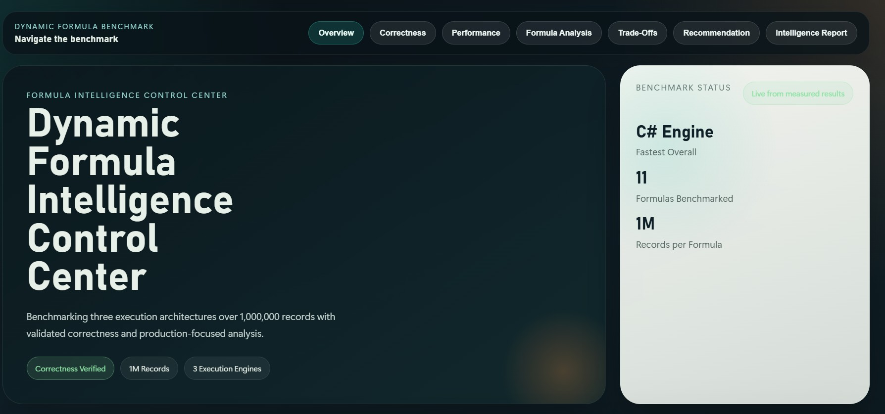

### Overview

The **Overview** section gives a benchmark snapshot of the system, including correctness status, data volume, fastest overall engine, and the number of execution engines in the comparison.

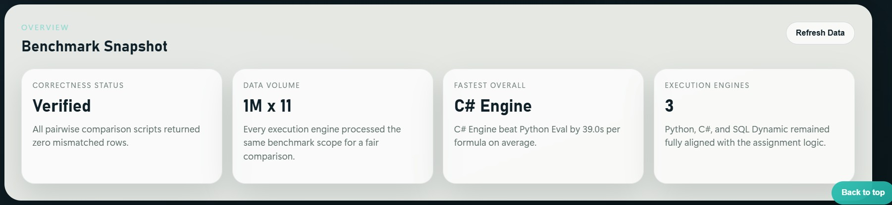

### Correctness

The **Correctness Verification Matrix** proves that the outputs of all three engines were compared row by row and that all benchmark comparisons returned mismatched_rows = 0.

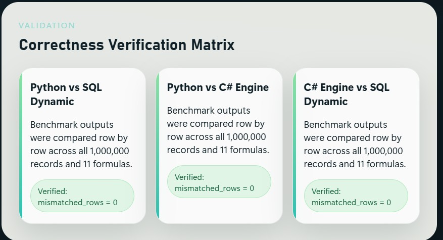

### Performance

The **Performance Comparison** section presents the average runtime of each engine and the ranking between C#, SQL Dynamic, and Python Eval.

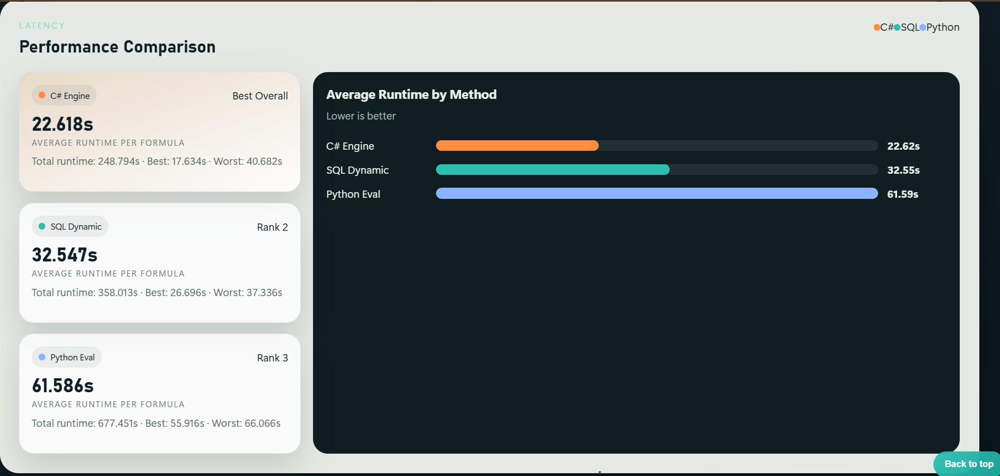

### Formula Analysis

The **Formula-Level Runtime Analysis** section shows how runtime changes from one formula to another, including category filters and per-formula benchmark cards.

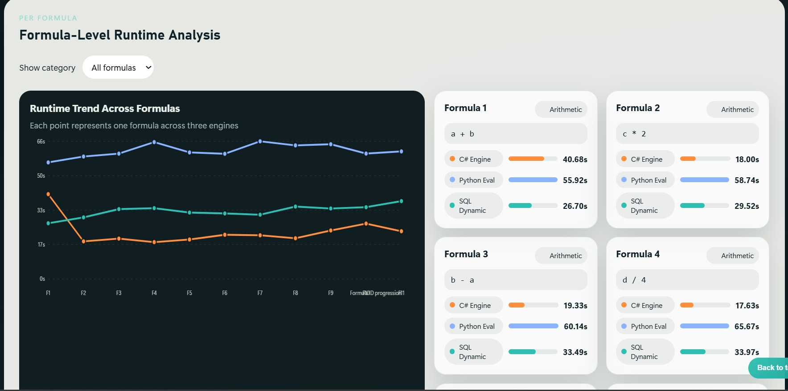

### Trade-Offs

The **Trade-Off Radar** section presents the architectural evaluation layer, including maintainability, extensibility, operational complexity, and runtime flexibility.

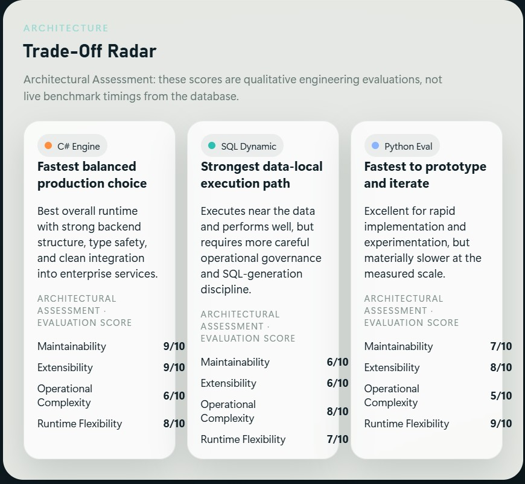

### Final Recommendation

The **Final Recommendation** section summarizes which engine is strongest for performance, which one is best for rapid implementation, and which one best fits a DB-centric deployment model.

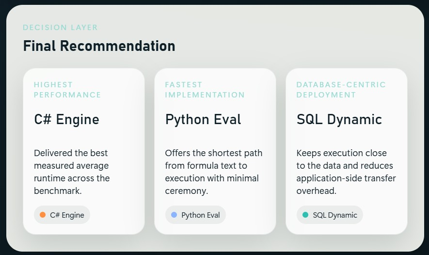

### Intelligence Report

The **Dynamic Benchmark Intelligence Report** section shows the local intelligence layer, including interactive benchmark Q&A, generated analytical findings, and access to PDF report generation.

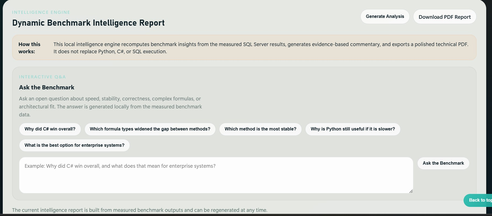
## Final Summary Report

The project includes a complete summary package for reviewers:

- [Final benchmark summary](./report/summary.md)
- [Intelligence summary](./report/intelligence_summary.md)
- [Generated PDF report](./report/benchmark-ai-analysis.pdf)

These files together provide the required **summary report screen**, the final benchmark conclusions, and the explanation of the measured results.

## Project Goal

The goal of the project is to evaluate which execution strategy is most suitable for **dynamic runtime formula calculation** when formulas are stored in the database and may change without recompiling the application.

The benchmark compares three required execution methods:

- `python_eval`
- `csharp_engine`
- `sql_dynamic`

## Architecture and Execution Engines

### 1. `python_eval`

Python loads formulas from `t_targil`, translates the database syntax into Python-compatible syntax, and evaluates the expression with `eval()`.

Main characteristics:

- fast to implement
- flexible for experimenting with new formula syntax
- slower than the other methods at the measured scale

### 2. `csharp_engine`

The C# solution reads the same formulas and evaluates them at runtime through a typed application layer. It uses a dedicated runtime expression engine and preserves a cleaner backend structure for production-oriented services.

Main characteristics:

- fastest measured runtime overall
- strong maintainability and extensibility
- best balance between speed and long-term backend design

### 3. `sql_dynamic`

SQL Server executes the formulas inside the database using dynamic SQL and stored-procedure orchestration. This keeps computation close to the data and reduces application-side transfer overhead.

Main characteristics:

- strong performance
- very suitable for DB-centric systems
- introduces more SQL-generation and operational complexity

## Creative Approach: Dynamic Intelligence Layer

In addition to the three required execution methods, the project includes a **local dynamic intelligence layer**.

Important honesty note:

- this is **not** a cloud LLM inference service
- it does **not** replace Python, C#, or SQL execution
- it works as a local analytical layer over measured benchmark outputs

What it adds:

- executive summaries
- ranked findings
- architectural interpretation
- scenario-based recommendations
- interactive benchmark Q&A
- downloadable PDF report generation

Relevant files:

- [docs/INTELLIGENCE_ENGINE.md](./docs/INTELLIGENCE_ENGINE.md)
- [report/intelligence_summary.md](./report/intelligence_summary.md)
- [report/benchmark-ai-analysis.pdf](./report/benchmark-ai-analysis.pdf)

## How the System Works

The project flow is intentionally data-driven and chronological:

1. The shared schema is created in SQL Server.
2. The formula definitions are inserted into `t_targil`.
3. The benchmark dataset is generated into `t_data`.
4. Each execution engine loads the same formulas and processes the same 1,000,000 records.
5. Every calculated output is written into `t_results`.
6. Runtime measurements are written into `t_log`.
7. SQL comparison queries validate that all methods produced identical outputs.
8. The API and dashboard visualize correctness, performance, and recommendations.
9. The intelligence layer generates the final analytical report and PDF.

This section is the practical **explanation of the working method** required by the assignment.

## Shared Database Contract

All methods use the same tables:

- `t_data`
- `t_targil`
- `t_results`
- `t_log`

This shared contract is what makes the benchmark comparable. Every method reads the same input formulas and data, and writes results in the same structure.

## Database Tables and Screenshot Evidence

The database layer is organized in a chronological flow that matches the benchmark pipeline:

1. input data is generated and stored
2. dynamic formulas are defined
3. execution results are written
4. runtime measurements are logged

### 1. `t_data` - Source Input Records

This table stores the generated benchmark dataset. Each row contains the numeric source columns used by all formula engines:

- `data_id`
- `a`
- `b`
- `c`
- `d`

Purpose:

- provides the common 1,000,000-row input dataset
- guarantees that Python, C#, and SQL Dynamic all calculate against the exact same records

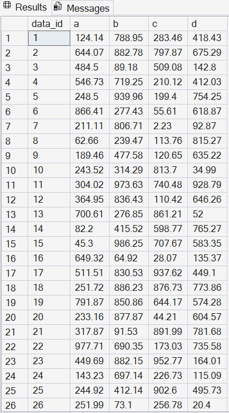

### 2. `t_targil` - Formula Definitions

This table stores the dynamic formulas themselves. It includes both simple expressions and conditional expressions:

- `targil_id`
- `targil`
- `tnai`
- `targil_false`

Purpose:

- keeps formula logic data-driven
- allows the engines to load formulas from the database instead of hardcoding them in source code
- supports arithmetic, complex mathematical, and conditional formulas

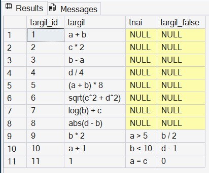

### 3. `t_results` - Calculated Outputs

This table stores the calculated result for every processed record and formula, per execution method:

- `result_id`
- `data_id`
- `targil_id`
- `method`
- `result`

Purpose:

- persists the actual computed outputs
- makes row-by-row correctness comparison possible between methods
- supports validation that all three engines return identical values

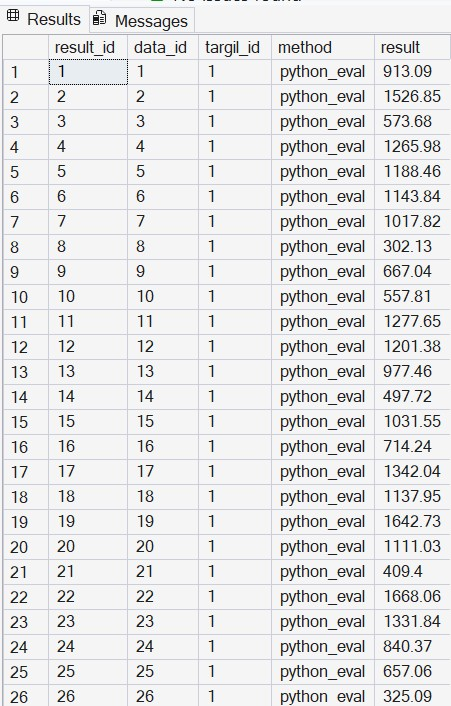

### 4. `t_log` - Runtime Benchmark Log

This table stores benchmark timing information for each formula and method:

- `log_id`
- `targil_id`
- `method`
- `run_time`
- `records_processed`

Purpose:

- records how long each engine needed to calculate each formula
- provides the raw data for the performance comparison dashboard
- supports summary metrics such as average runtime, minimum runtime, maximum runtime, and total runtime

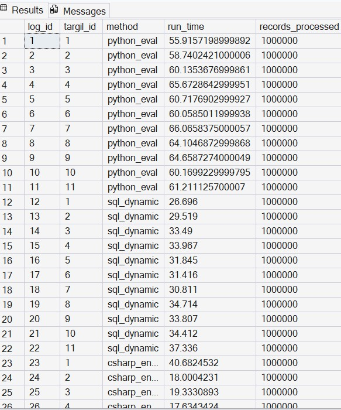

## Benchmark Conclusions and Final Recommendation

### Correctness

Correctness was validated by comparing all method pairs inside SQL Server:

- `python_eval` vs `sql_dynamic`
- `python_eval` vs `csharp_engine`
- `csharp_engine` vs `sql_dynamic`

All comparison runs returned:

`mismatched_rows = 0`

This confirms that all three implementations produced identical calculation results.

### Performance Ranking

Measured benchmark results showed the following overall ranking:

1. `csharp_engine` was the fastest overall method
2. `sql_dynamic` was the second-fastest method
3. `python_eval` was the slowest method

Average runtime per formula:

- `csharp_engine`: `22.618` seconds
- `sql_dynamic`: `32.547` seconds
- `python_eval`: `61.586` seconds

### Final Recommendation

The final recommendation for a real production-oriented system is **`csharp_engine`**.

Reasoning:

- it delivered the best measured runtime
- it preserves strong backend maintainability
- it is easier to govern and extend in long-lived services
- it provides a stronger balance between speed and architectural quality than the alternatives

`sql_dynamic` remains a very strong option for database-centric environments, while `python_eval` is valuable for rapid prototyping and experimentation.

## How to Run Locally

### Prerequisites

- Python 3.11+
- .NET 8 SDK
- SQL Server / SQL Server Express
- ODBC Driver 17 for SQL Server

### 1. Create the schema and seed formulas

Run the SQL scripts in this order:

- [database/01_schema.sql](./database/01_schema.sql)
- [database/02_seed_formulas.sql](./database/02_seed_formulas.sql)
- [database/04_seed_data_sqlserver.sql](./database/04_seed_data_sqlserver.sql)

### 2. Install Python dependencies

```bash
pip install -r requirements.txt
```

### 3. Run the Python engine

```bash
python python-solution/scripts/run_python_eval.py
```

### 4. Run the SQL dynamic engine

Execute:

- [sql-solution/03_dynamic_sql.sql](./sql-solution/03_dynamic_sql.sql)

inside SQL Server.

### 5. Run the C# engine

Open the solution:

- [csharp-solution/DynamicFormulaBenchmark.sln](./csharp-solution/DynamicFormulaBenchmark.sln)

Then run the project, or execute it through the .NET CLI.

### 6. Compare correctness

Use:

- [database/05_compare_methods.sql](./database/05_compare_methods.sql)

### 7. Run the local API and dashboard

```bash
$env:DB_ENGINE="sqlserver"
$env:SQLSERVER_CONNECTION_STRING="Driver={ODBC Driver 17 for SQL Server};Server=localhost\SQLEXPRESS;Database=DynamicFormulaBenchmark;Trusted_Connection=yes;TrustServerCertificate=yes;"
python -m uvicorn report-api.app.main:app --reload
```

Then open:

```text
http://127.0.0.1:8000
```

## Repository Structure

```text
dynamic-formula-benchmark/
|-- csharp-solution/
|   |-- DynamicFormulaBenchmark.sln
|   `-- DynamicFormulaBenchmark/
|       |-- DynamicFormulaBenchmark.csproj
|       |-- Program.cs
|       |-- FormulaEngine.cs
|       |-- DatabaseService.cs
|       |-- ExpressionSyntaxTransformer.cs
|       `-- Models/
|           |-- FormulaDefinition.cs
|           `-- DataRecord.cs
|-- database/
|   |-- 01_schema.sql
|   |-- 02_seed_formulas.sql
|   |-- 04_seed_data_sqlserver.sql
|   `-- 05_compare_methods.sql
|-- docs/
|   |-- FORMULA_EVALUATION.md
|   |-- INTELLIGENCE_ENGINE.md
|   `-- SQL_SERVER_RUNBOOK.md
|-- python-solution/
|   |-- scripts/
|   |   |-- seed_data.py
|   |   |-- run_python_eval.py
|   |   |-- run_python_eval_sqlserver.py
|   |   `-- compare_results.py
|   `-- src/
|       |-- config.py
|       |-- db.py
|       |-- sqlserver_db.py
|       |-- formula_runtime.py
|       `-- syntax_transformer.py
|-- report/
|   |-- benchmark-ai-analysis.pdf
|   |-- intelligence_summary.md
|   |-- summary.md
|   `-- screenshots/
|       |-- t_data.jpg
|       |-- t_targil.jpg
|       |-- t_results.jpg
|       |-- t_log.jpg
|       |-- landing-navigation-dashboard.jpg
|       |-- overview-dashboard.jpg
|       |-- correctness-dashboard.jpg
|       |-- performance-dashboard.jpg
|       |-- formula-analysis-dashboard.jpg
|       |-- tradeoff-dashboard.jpg
|       |-- recommendation-dashboard.jpg
|       `-- intelligence-dashboard.jpg
|-- report-api/
|   |-- app/
|   |   |-- analysis_engine.py
|   |   |-- main.py
|   |   `-- pdf_report_builder.py
|   `-- export_public_snapshot.py
|-- report-ui/
|   |-- assets/
|   |   `-- benchmark-ai-analysis.pdf
|   |-- data/
|   |   `-- dashboard.json
|   |-- .nojekyll
|   |-- app.js
|   |-- index.html
|   `-- styles.css
|-- sql-solution/
|   |-- 03_dynamic_sql.sql
|   `-- README.md
|-- .gitignore
|-- index.html
|-- PROJECT_PLAN.md
|-- README.md
|-- REPOSITORY_STRUCTURE.md
`-- requirements.txt
```

For a standalone structure explanation, see [REPOSITORY_STRUCTURE.md](./REPOSITORY_STRUCTURE.md).

## Supporting Technical Documents

- [docs/FORMULA_EVALUATION.md](./docs/FORMULA_EVALUATION.md)
- [docs/SQL_SERVER_RUNBOOK.md](./docs/SQL_SERVER_RUNBOOK.md)
- [docs/INTELLIGENCE_ENGINE.md](./docs/INTELLIGENCE_ENGINE.md)
- [report/summary.md](./report/summary.md)
- [report/intelligence_summary.md](./report/intelligence_summary.md)

## Public Static Deployment

This repository is also prepared for a free public static deployment through GitHub Pages.

How it works:

- the live local version uses FastAPI + SQL Server
- the public GitHub Pages version uses a static snapshot generated from the measured benchmark data
- the dashboard still presents the real benchmark outputs, charts, findings, and downloadable PDF report

To refresh the public snapshot before pushing:

```bash
$env:DB_ENGINE="sqlserver"
$env:SQLSERVER_CONNECTION_STRING="Driver={ODBC Driver 17 for SQL Server};Server=localhost\SQLEXPRESS;Database=DynamicFormulaBenchmark;Trusted_Connection=yes;TrustServerCertificate=yes;"
python report-api/export_public_snapshot.py
```

## Submission Checklist Coverage

This README now directly covers the required submission elements:

- summary report access
- explanation of the working method
- explanation of the three execution methods
- final recommendation
- repository organization
- database screenshots
- public access link to the dashboard
- generated PDF report


